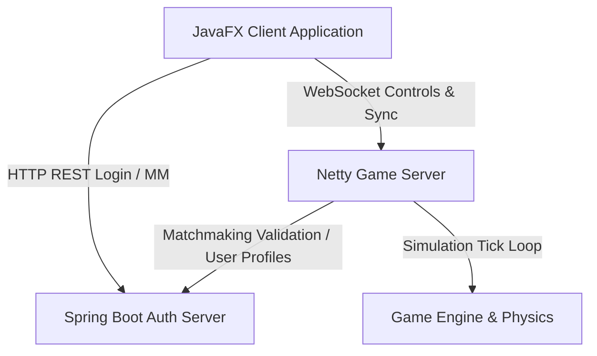
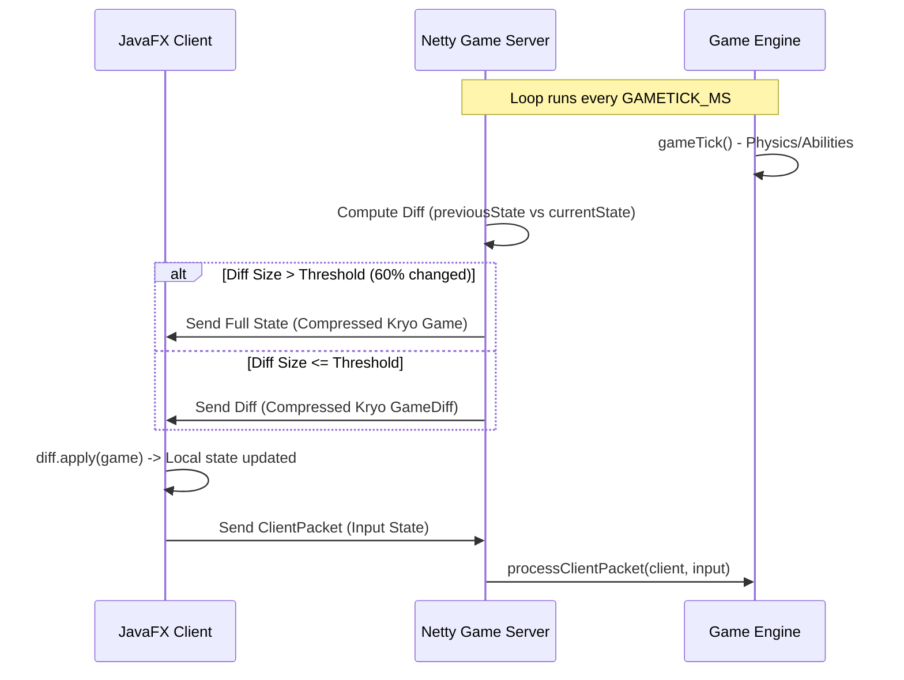

# TitanBall Architecture and Developer Guide

TitanBall is a fast-paced, real-time multiplayer team sports game built with JavaFX, Spring Boot, Netty, and a custom physics and state-synchronization engine.

---

## 1. High-Level Architecture Overview

TitanBall is split into three main components residing in the same repository:



### Components:
1. **JavaFX Client Application (`client`)**: The desktop application. Handles user interface rendering, keyboard/mouse controls, local audio playback, and rendering of game frames received from the server.
2. **Spring Boot Authentication Server (`authserver`)**: A classic REST API utilizing Spring Security and JWTs for user authentication, tracking rating changes (via MMR), premade team coordination, and handling matchmaking requests.
3. **Netty Game Server (`gameserver`)**: A lightweight Netty WebSocket server. It hosts the real-time gameplay sessions, reads incoming control packets (`ClientPacket`), and sends compressed game-state frames (`GameDiff`) using a custom tick-based simulation.
4. **Game Engine (`gameserver/engine`)**: Contains the game loop physics, entity pool, collision resolution, character abilities, and win/loss rules.

---

## 2. Real-Time State Synchronization

Because of the high-speed nature of TitanBall, a custom delta-compression protocol was implemented to keep network usage low:



### Protocol Pipeline details:
- **Kryo Serialization**: Built-in Java serialization is bypassed in favor of Kryo, configured in [KryoRegistry.java](file:///c:/Users/markd/IdeaProjects/TitanBall/src/networking/KryoRegistry.java).
- **Zstandard Compression**: Outgoing base64 payloads are compressed using Zstandard (`zstd-jni`) to reduce network payload sizes.
- **Reflection-Based Diffing**: [GameDiff.java](file:///c:/Users/markd/IdeaProjects/TitanBall/src/networking/GameDiff.java) dynamically checks differences between the previous tick and the current tick. It generates key-value pairs mapping paths of mutated fields to their new values, allowing the client to execute `diff.apply(game)` in-place.
- **Anti-Cheat Censors**: The game server modifies the state before serialization to censor coordinates/information for stealthed or blinded entities based on the receiving player's team.

---

## 3. Game Engine Simulation Loop

The server runs a tick-based physics loop:
- **Tick Interval**: Controlled by `GAMETICK_MS` (typically 30ms).
- **Tick Method**: `GameEngine.gameTick()` handles:
  1. Advancing frames since start.
  2. Running entity tick actions (Wall, Wolf, Portal, Fire, Trap).
  3. Updating ball position if possessed by a player.
  4. Evaluating passive buffs/debuffs on players and entities.
  5. Applying client inputs (running velocity, boosting, casting skills).
  6. Calculating collisions (`intersectAll()`) and scoring detection (`detectGoals()`).

---

## 4. Building and Running Locally

The build configuration is managed through the Maven [pom.xml](file:///c:/Users/markd/IdeaProjects/TitanBall/pom.xml).

### Server & Auth Build (Default Package)
To package the Spring Boot Server and Netty Game Server together:
```powershell
mvn clean package
```
This produces `target/loginloadbal.jar` containing the auth and matchmaking server.

### Client Shaded Jar Build
To package the client into a single executable shaded jar with JavaFX dependencies bundled:
```powershell
mvn clean package -P shaded-client
```
This produces `target/Titanball.jar`.

### Starting the Server
1. Ensure MySQL is running on port 3306 with a database named `mysql`.
2. Configure credentials in [application.properties](file:///c:/Users/markd/IdeaProjects/TitanBall/application.properties).
3. Run:
```powershell
java -jar target/loginloadbal.jar
```

### Starting the Client
Run the shaded client:
```powershell
java -jar target/Titanball.jar
```
Or run the launcher:
```powershell
java -jar Titanball-Launcher/getdown.jar Titanball-Launcher
```
